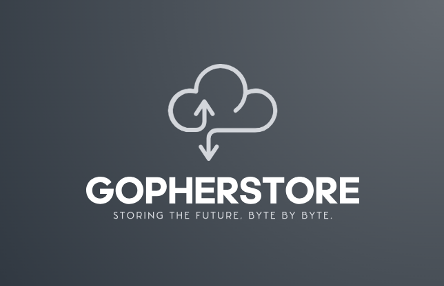

# GopherStore

<div align="center">
  
  <br><br>
  <a href="https://github.com/TejasPrabhu/GopherStore/blob/main/LICENSE"></a>
  <a href="https://goreportcard.com/report/github.com/TejasPrabhu/GopherStore"></a>
  <a href="https://github.com/TejasPrabhu/GopherStore/actions"></a>
</div>

GopherStore is a decentralized peer-to-peer file storage system that allows nodes to function as both clients and servers, facilitating robust data distribution without relying on central servers. This enhances data redundancy, making GopherStore ideal for secure, distributed file management tasks.

## Features

- **Decentralized Architecture:** Every node can send, receive, and store files.
- **Peer-to-Peer Communication:** Uses TCP/IP for direct file transfer between nodes without intermediaries.
- **Data Compression:** Integrates GZIP compression to reduce data transfer volume and enhance transmission speed.
- **Flexible File Management:** Supports basic file operations like send, fetch, and delete across the network.

## Getting Started

### Prerequisites

- Go 1.22 or later
- Git

### Installation

Clone the repository to your local machine:

```bash
git clone https://github.com/TejasPrabhu/GopherStore.git
cd GopherStore
```

Build the project:

```bash
go build
```

Running GopherStore

```bash
./GopherStore -port=<port_number>
```

## Usage

To interact with the GopherStore system, use the following commands in the CLI after starting your server:

Send File:
```bash
send <destination IP:port> <file path>
```

Fetch File:
```bash
fetch <destination IP:port> <file path>
```

Delete File:
```bash
delete <destination IP:port> <file path>
```

## Contributing
Contributions are what make the open-source community such an amazing place to learn, inspire, and create. Any contributions you make are greatly appreciated.

1. Fork the Project
2. Create your Feature Branch (git checkout -b feature/AmazingFeature)
3. Commit your Changes (git commit -m 'Add some AmazingFeature')
4. Push to the Branch (git push origin feature/AmazingFeature)
5. Open a Pull Request

[](code_of_conduct.md)

## License
Distributed under the MIT License. See [LICENSE](LICENSE) for more information.

## Contact
Tejas Prabhu: tejas.prabhu29@gmail.com

Project Link: https://github.com/TejasPrabhu/GopherStore