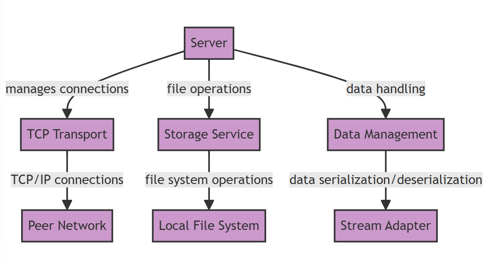

# GopherStore Architecture Documentation
## Introduction
This document outlines the architectural design of the GopherStore, a decentralized peer-to-peer file storage system. The architecture supports robust peer interactions where each peer can serve both as a client and a server, facilitating data distribution without centralized control.

## Architecture
The following diagram illustrates the high-level interactions within the GopherStore architecture:

## Architectural Components

**TCP Transport**
- Handles TCP network operations, establishing and managing connections.
- Communicates directly with the peer network to transmit and receive data packets.

**Server**
- Central coordinator for processing commands and dispatching file operations across the network.
- Interacts with the TCP Transport to manage data transmission and with Storage Service for data persistence.

**Data Management**
- Utilizes StreamAdapter for efficient data serialization and deserialization.
- Manages the compression and decompression of data streams to optimize network transfer.

**Storage Service**
- Implements file storage mechanisms on the local filesystem.
- Handles operations such as storing, retrieving, and deleting files as requested by peers.

**Stream Adapter**
- Facilitates the conversion of data between serialized bytes and application-level objects.
- Provides compression and decompression functionalities to enhance data transfer efficiency over the network.

**Logger**
- Provides comprehensive logging throughout the system to track operations, errors, and system messages.

## System Workflow

### Initialization
When the GopherStore server is launched, it systematically sets up its environment:

TCP Listener: The server initiates by establishing a TCP listener on a specified port. This listener is essential for the peer-to-peer network, enabling the node to accept incoming connections from other peers. This step ensures that the server is ready to participate in the decentralized network, both to receive and transmit data.

Service Setup: Alongside initializing the network listener, the server configures necessary services that are critical for its operation. This includes services for managing file storage (handling the storage, retrieval, and deletion of files locally) and data transmission services (responsible for the serialization and compression of data).

### Command Processing
The server handles commands through a robust, multi-threaded approach that allows it to process both local (via CLI) and network requests concurrently:

Command Interpretation: Commands such as send, fetch, and delete are parsed to extract necessary actions and parameters. This process involves interpreting file paths, destination addresses, and other relevant data that dictate the subsequent operations.

Execution: Based on the parsed command, corresponding actions are triggered. For example, a send command initiates the serialization and subsequent transmission of a file, whereas a fetch command would entail retrieving a file from the network.

### Data Transmission

Serialization: The system serializes data, which may include files or command information, using efficient serialization mechanisms like GOB (Go's native binary serialization format). This ensures that complex data structures are converted into a manageable byte stream, ready for transmission.

Compression: To maximize efficiency in data transfer, the system compresses data using GZIP before transmission. This step significantly reduces the data size, enhancing transmission speed and reducing network load.

### File Management

File Storage: Incoming data that needs to be stored is handled meticulously by the file management system. It involves creating files, managing file storage paths, setting appropriate permissions, and ensuring data integrity during the storage process.

File Retrieval and Deletion: Retrieval operations involve locating and reading files from local storage, ensuring the correct handling of file permissions and data integrity. For deletion operations, the system locates the file within the local directory structure and removes it securely, ensuring that all references are appropriately cleared to maintain system integrity.
